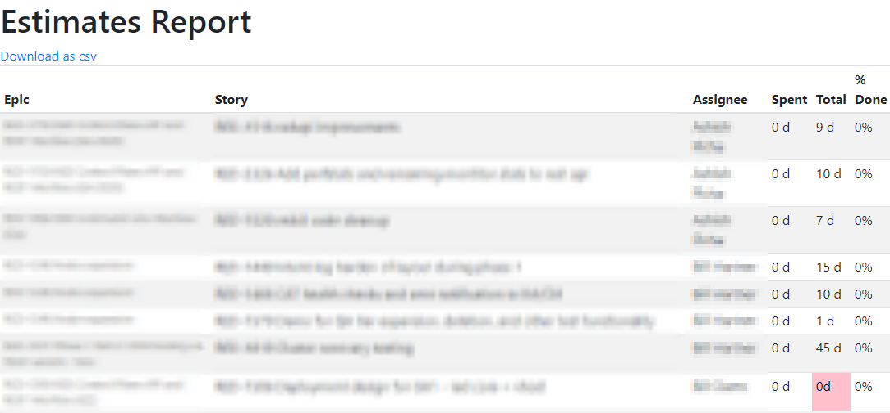
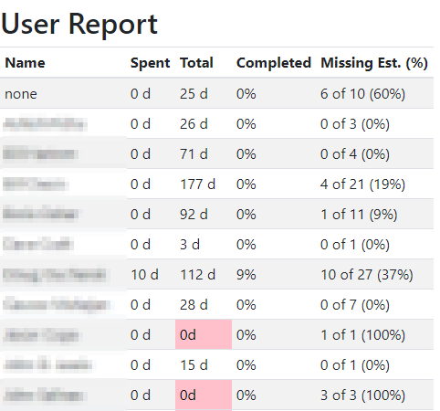

# jira-status-reporter

Collection of node scripts to query, store, and report on Jira issues.

## Features
* Estimate Report: See which Stories have/have not been estimated

* User Report: See progress on Stories, per Assignee

* Graphical display of issue links (using Mermaid)


* JSON/HTML list of projects (with or without issue type counts)

* JSON/HTML list of fields (standard & custom)


## Installation and Setup
### For live queries
* ```sh
  git clone https://github.com/jolewis-ddn/jira-status-reporter
  cd jira-status-reporter
  npm install
  mkdir data
	```
### Configuration
* Copy (or rename) `default-template.json` to `default.json`
  * Note: Other formats may be used. See  for full details. The fields in default-template.json` must exist in whatever config file/format you choose.
* Update the values in `default.json` as appropriate
  * `fa` is optional and must include the full URL to your FontAwesome JavaScript kit - e.g. ,
    `"fa": "https://kit.fontawesome.com/0123456789.js"`
    * If you enable FontAwesome, you may wish to adjust the faIcons object to point to different icons.
  * All others fields are required
### For cached queries - _optional_
* Create the database
  * ```
    cd $dataPath
    sqlite3 jira-stats.db
    >.read ./jira-stats.sql
    >.quit
    ```
## Running
`node app.js`

## Cache notes
* `?flush=yes` is available for many endpoints to force a cache refresh. Note: this will wipe out the cache for all users

## Endpoints
* `/`: no-op
### Configuration
* `/components`: Unique and sorted list of all the Components
* `/config`: Current config
* `/fields`: All Jira fields (standard and custom)
### Requirements
* `/requirements`: Requirements report (cached)
### Estimates
* `/estimates`: List which Stories have been estimated (cached)
### Issues
* `/chart`: Visualize timeseries data using cache
* `/dashboard`: Data visualization of current status (no cache)
* `/epics`: Visualize Epic status (includes linked issues)
* `/filter`: Visualize issue status using existing Jira filter
* `/issueTypes`: List of issue types (either project-specific or global)
* `/links`: Visualize issue links
* `/report`: Simple data report on issue statuses over time (epic count, open issue count, updates this month/week, etc.)
* `/unestimated`: Table showing the number of unestimated Stories (with a link to Jira)
### Releases
* `/burndown`: Burndown charts (with optional forecast) for all issues or specific release and/or Component
* `/releases`: List of versions (cached); links to /progress
* `/progress`: Release progress report (parameter: release ID)
### Users and Groups
* `/groups`: Shows a list of groups. 
  * `?format=html` to see the list in HTML (unordered list)
  * `?filter=yes` to see the subset (as specified by the userGroups config value)
    * If userGroups array *is set* in the config, it will be excluded (and the members of the remaining groups will be fetched). 
    * If userGroups *is not set*, the full list of groups (without members) will be fetched.
### Cache
#### General
* `/cache/stats`: All dates covered by cache
* `/cache/flush`: All dates covered by cache

#### JSR Cache
* `/dates`: All dates covered by cache
* `/homedir`: The current root cache folder
* `/series`: Issue counts by status
* `/cacheJSR`: Current in-memory cache
* `/datafilesJSR`: List of data files in cache
* `/rebuild-cacheJSR`: Delete and recreate the cache from source data
* `/refresh-cacheJSR`: Update the cache with new source data files
* `/reread-cacheJSR`: Re-read the cache from disk
* `/resetJSR`: Re-initialize the cache
* `/update-cacheJSR`: Add missing files to the cache
* `/wipe-cacheJSR`: Delete the cache

## Usage example

1. Collect status for a specific month: `./getIssueCountsByMonth.sh <month-number>` (e.g. `6` for June)
1. Collect stats for a specific status and month: `node getIssueCountsByStatusAndMonth.js -s ICEBOX -m 6`
1. Pull all Jira issue data for all statuses from yesterday and store as JSON files in `./$dataPath/`: `./pullDataForYesterday.sh`
    * ** Warning ** This can result in significant data storage, depending on your Jira project size
1. Run the status server
  * Production: `npm run server`
  * Debug: `npm run server-debug`
  1. Open http://localhost:9999/chart to see the default chart (use server.port as set in your config file)

* You can specify alternate configurations by setting NODE_ENV.
  * For example, if a config file named `Production.json` exists in the `config` directory, setting NODE_ENV to `Production` before running `JiraStatusServer.js` will pick up the values from `config/Production.json` (or `config/Production.yaml` or any other config file supported by `node-config` (see above).)

## Configuration File
The following elements can be set in the config file:
* jira:
  * protocol: `http` or `https`
  * host: Jira server hostname
  * username: Full Jira username
  * password: User password or token with sufficient rights to execute the queries
  * apiVersion: Set to the integer or `latest`
* server: Local server port
* graphicServer
* project: Jira project as the default
* dataPath: Relative path to data files (Default: 'data')
* ignore
* fa: Font Awesome link (full URL, including `.js`)
* userGroups: Groups in Jira which are commonly used; membership is fetched only for groups in this list
* userExclude: Individuals to not include in userGroup membership (type: array)
* releaseExcludeTypes: Status(es) to exclude from the Progress Report (type: array) [Note: this has the same result as using the `exclude` query parameter, but cannot be overridden by the end user.]
* adminKey: Parameter to enable/display administrative functions
* issueTypes: Optional list of specific issue types. (Default: Epic, Story, Task, Sub-task, Bug, Test)

## Getting help
1. All node scripts have a help page: `node script.js --help`

## Development setup

To turn on debug output, set the `DEBUG` environment variable, like so:

```sh
set DEBUG=*
```

## Folders

* `./$dataPath/`: Where the database and all JSON files will be stored (dataPath is set in Config file; default = 'data')
* `./.cache/`: Project data (JSR) cache

## Main Files

* `JiraStatusServer.js`: Run a local server for handling queries
* `JiraStatusReporter.js`: The main Javascript class
* `*.sh`: Shell-wrappers for the Javascript files
  * `pullDataForYesterday.sh` queries and stores all Jira issues by Status for the prior calendar day. All data is stored in `./$dataPath/*.json` files with the Status and date in the filename.
* `get*.js`: Query (and store) Jira issue details (counts or data)
  * `getIssueCounts*` only return a total number
  * `getIssues*` return the full Jira issue data
* `jira-stats.sql`: Table definition for local jira stats

## Dependencies
* Node modules
  * `jira-client`: Main Jira client tool
  * `commander`: For parsing command line options
  * `restify`: For `simple-server.js`
  * `debug`: For logging
  * `supports-color`: For `debug`
  * `date-fns`: For date manipulation
  * `ava`: For testing
  * `istanbul`: For test coverage
  * `rando.js`: For random chart IDs
  * `node-config`: Manages configuration
  * `node-cache`: Manages general cache
* Working QuickChart server
  * See https://quickchart.io/ for instructions
  * Configure the server and port in the config.js file

## License

Distributed under the MIT license. See ``LICENSE`` for more information.

[https://github.com/jolewis-ddn/](https://github.com/jolewis-ddn/)
